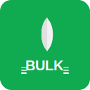

# Visual Assets Preview

Version 1.0.4 now includes professional visual assets!

## Created Assets

### 1. Banner Image
**File:** `assets/banner.svg`
**Size:** 800x200px
**Usage:** README header, documentation


**Features:**
- MongoDB logo with gradient background
- "MongoDB Bulk" title
- "Bulk Operations for n8n" subtitle
- Feature highlights (Fast, Insert/Update/Delete Many, Mixed Bulk Write)
- Decorative stacked layers showing "bulk" concept

---

### 2. Square Logo
**File:** `assets/logo-square.svg`
**Size:** 128x128px
**Usage:** Package icon, social media previews



**Features:**
- Green background (#10aa50 - MongoDB brand color)
- White MongoDB leaf icon
- "BULK" text
- Decorative layer indicators on sides
- Professional, recognizable design

---

### 3. Enhanced Bulk Icon
**File:** `nodes/MongoDbBulk/mongodb-bulk.svg`
**Size:** 64x64px
**Usage:** Alternative node icon


**Features:**
- MongoDB leaf icon centered
- Stacked layers indicator (representing bulk operations)
- Lightning bolt (representing fast operations)
- Light background circle
- Visual metaphor for bulk/many operations

---

### 4. Standard MongoDB Icon
**File:** `nodes/MongoDbBulk/mongodb.svg`
**Size:** 32x32px
**Usage:** Current node icon in n8n

The standard MongoDB leaf icon used by the node.

---

## npm Package Display

The package now shows on npm with:
- ✅ Banner image in README
- ✅ Badges for version, downloads, license
- ✅ Professional visual identity
- ✅ Assets included in package

## Viewing on npm

Visit: https://www.npmjs.com/package/n8n-nodes-mongo-bulk

You'll see:
1. Banner at the top of the README
2. Professional formatting with badges
3. Clear visual hierarchy

## Using the Assets

### In Your Documentation
```markdown
# Banner


# Logo

```

### In package.json (optional)
```json
{
  "icon": "assets/logo-square.svg"
}
```

### Creating PNG Versions

If you need PNG versions for social media or other uses:

**Using an online converter:**
1. Go to https://cloudconvert.com/svg-to-png
2. Upload the SVG file
3. Download the PNG

**Using command line tools:**
```bash
# Using ImageMagick
convert assets/banner.svg assets/banner.png
convert assets/logo-square.svg -resize 512x512 assets/logo-512.png

# Using Inkscape
inkscape assets/banner.svg --export-type=png --export-filename=assets/banner.png
```

## Design Specifications

### Colors
- **Primary Green:** `#10aa50` (MongoDB brand)
- **Light Green:** `#13aa52`
- **Orange:** `#ffa500` (accent for lightning bolt)
- **Text:** `#333333` (dark gray)
- **Light Text:** `#666666` (medium gray)
- **White:** `#ffffff`

### Typography
- **Font Family:** Arial, sans-serif
- **Title Size:** 48px (bold)
- **Subtitle Size:** 24px
- **Body Text:** 14px

### Visual Elements
- **Rounded corners:** 16px (square logo)
- **Rounded rectangles:** 4px (layers)
- **Opacity layers:** 0.3, 0.5, 0.7, 1.0 (for depth effect)

## Future Enhancements

Potential additions:
- Animated GIF showing bulk operations concept
- Dark mode versions of assets
- Different size variations (16x16, 32x32, 64x64, 512x512)
- Favicon for documentation site
- Social media cards (1200x630 for Twitter/Facebook)

## License

All assets are part of the n8n-nodes-mongo-bulk package and are licensed under MIT License.

---

**Created:** 2025-10-31
**Version:** 1.0.4
**Package:** n8n-nodes-mongo-bulk
